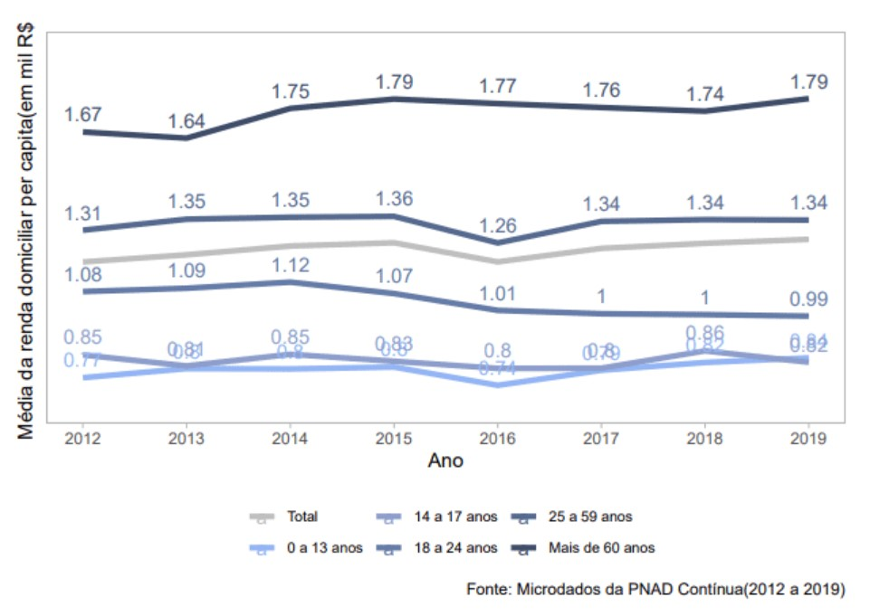
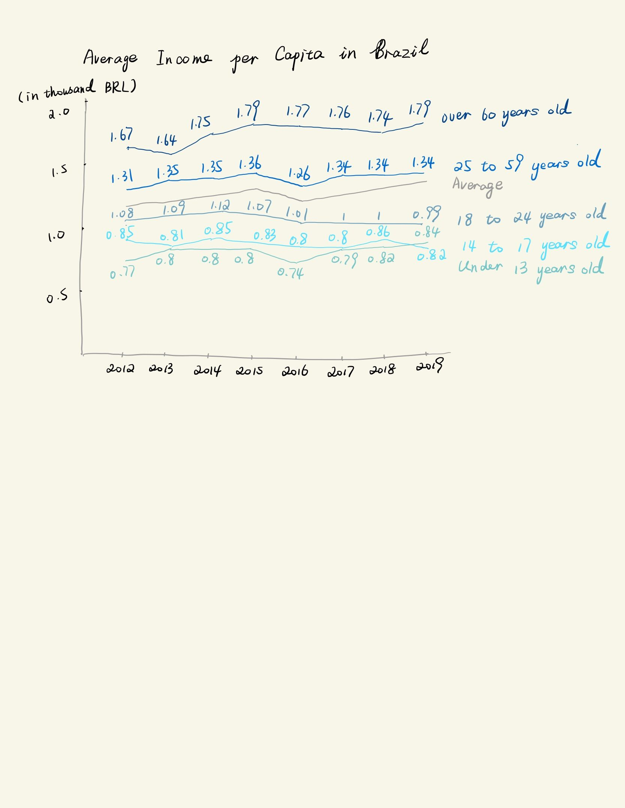

# Link to the Original Data Visualization

https://policyviz.com/hmv_post/average-income-per-capita-in-brazil/

I selected this data visualization because the graph is not too complicated to understand, and the flaws of this graph are also obvious. In addition, it reflects the Average Income per Capita in Brazil, which is meaningful.

# First Redesign Process

I found that the labels in the graph are overlapped seriously, which makes audiences hard to read. And the legend is at the bottom of the graph. Because the colors for each age category are similar, it's hard to match the lines with the legend.
Thus, I decided to redesign 2 thing: 1.I expanded the scale of y-axis, so that the labels won't be overlapped anymore. 2.I made the legend on the left of the graph, with the order corresponding to the lines' order.

# The First Draft

# Feedback from Audiences

Q1: Can you tell me what you think this is?
A from audience 1: This a graph on demographic data in Brazil.
A from audience 2: Trends in average income per capita in Brazil by age group relative to the overall average from 2012-2019. 

Q2: Can you describe to me what this is telling you?
A from audience 1: This is a chart describing average per capita income in Brazil throughout the years by different age groups.
A from audience 2: Elderly (over 60 years old) has largest increase in average income, followed by 25-59 years old from 2012-2019. Workers below 25 generally see a fall in average income. 

Q3: Is there anything you find surprising or confusing?
A from audience 1: No. There is not.
A from audience 2: Why is the elderly seeing a far greater increase in average incomes when they should be retiring? What are the drivers?
Why is there an average income for under 13 years old? Are they even legal to work? Are they receiving income from govt payouts/parents?

Q4: Who do you think is the intended audience for this?
A from audience 1: Readers of a statistical report or the general public looking for information on the populace in Brazil.
A from audience 2: Policymakers (Dept of Labor) can use this to assess the state of Brazil’s workforce as well as evaluate policies they had implemented for certain groups (e.g. over 60 years old)

Q5: Is there anything you would change or do differently?
A from audience 1: I may add a grid just to make the scale more intuitive or add numbers to the average data or highlight the area below average data to make it stand out more.
A from audience 1: Be clear what income means – Is it from wages from work or include govt handouts/transfers etc.

I took the recommendation of adding a grid to make the scale more intuitive. But I didn't highlight the lines which are below to the average line, because this graph only express the average income per capita among different groups of people, it doesn't aim to emphasize the groups which have lower income than average. And I did take the advice of being clear what income means, because the data source doesn't provide this information.

In addition, I changed the "Total" in original graph to "Average", because I think this line represents an average income through all the age groups, and the legend "Total" makes the graph confusing.

# My Final Data Visualization

<object class='tableauViz' width='1504' height='808' style='display:none;'><param name='host_url' value='https%3A%2F%2Fprod-apnortheast-a.online.tableau.com%2F' /> <param name='embed_code_version' value='3' /> <param name='site_root' value='&#47;t&#47;siyugongtableau' /><param name='name' value='AverageIncomeperCapitainBrazil&#47;Sheet1' /><param name='tabs' value='no' /><param name='toolbar' value='yes' /><param name='showAppBanner' value='false' /></object>

# Data Source

Microdados da PNAD Continua (2012 to 2019)
https://www.ibge.gov.br/estatisticas/sociais/trabalho/17270-pnad-continua.html?=&t=o-que-e

<noscript></noscript><object class='tableauViz'  style='display:none;'><param name='host_url' value='https%3A%2F%2Fpublic.tableau.com%2F' /> <param name='embed_code_version' value='3' /> <param name='site_root' value='' /><param name='name' value='Assignment3_16139316854420&#47;Sheet1' /><param name='tabs' value='no' /><param name='toolbar' value='yes' /><param name='static_image' value='https:&#47;&#47;public.tableau.com&#47;static&#47;images&#47;As&#47;Assignment3_16139316854420&#47;Sheet1&#47;1.png' /> <param name='animate_transition' value='yes' /><param name='display_static_image' value='yes' /><param name='display_spinner' value='yes' /><param name='display_overlay' value='yes' /><param name='display_count' value='yes' /><param name='language' value='en' /><param name='filter' value='publish=yes' /></object>
                
