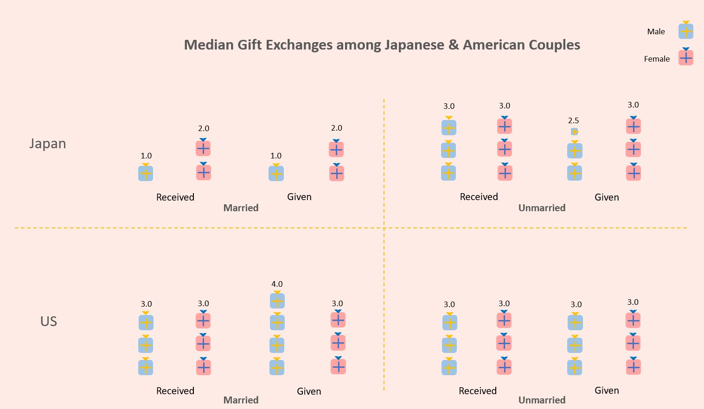

## Final Project

# From sweet Vows to Broken Families

What do you estimate is the divorce rate of American families in recent years? And I guess many people will underestimate this. The United States has the 6th highest divorce rate in the world. However, the divorce in America has been falling fast in recent years.

## How the Divorce Rate Has Changed over the Last 100 Years

The divorce rate just hit a record low in 2019. For every 1,000 marriages in 2019, only 14.9 ended in divorce, according to the newly released American Community Survey data from the Census Bureau, which is the lowest rate in 50 years. 

However, although the divorce in America just hit a record low, it still much higher than that in many other countries. 

<iframe
src="https://public.tableau.com/views/RatiooftheNumberofDivorcesbyCountriesin2018per1000people/Sheet1?:showVizHome=no&:embed=true" width="100%" height="600" seamless frameborder="0" scrolling="no"></iframe>
Image 1

Using one years data may not be convincing enough to compare the ratio of divorces by countries, so I will show you the trend of divorces since last century.

<iframe
src="https://public.tableau.com/views/AverageNumberofDivorcesper1000PeoplebyCountries/Sheet2?:showVizHome=no&:embed=true" width="100%" height="600" seamless frameborder="0" scrolling="no"></iframe>
Image 2

From this chart, we can find that the divorce rate in the US has fluctuated violently from 1920 t0 2018. The reasons are related to the history and cultural development of the United States.

* The Reason behind this Fluatuation
  * During World War I, women entered the workforce when the US joined  World War II. They gained more independence and freedom, leading to a higher divorce rate in the US. In 1940, the rate was 2 divorces per 1,000 people, but reached 3.4 in 1947. 
  * In The 1950s, the idea of the nuclear, All-American Family was created, which emphasized the family unit and marriage. Thus the divorce rate dropped again to 2.3 per 1,000 people in 1955. 
  * During the 1960s, women started to close the education gap and the US started to seek more progressive politics. As a result, women sought more independence, causing the divorce rate to rise significantly. In 1969, the rate jumped to 3.2 per Americans.
  * The 1970s were categorized by free love. People paid less attention on coupling and marriage, so the divorce rates rose dramatically. In this decade, divorce rate reached an all-time high. In 1970, the rate was 3.5, and by 1979, the rate was 5.3 per 1,000 American, with 1,193,062 divorces that year.  
  * After that peak, the rate continued to decline rapidly. TIME reports that older generations continue to get divorced, however, since the younger generation is getting married later in life and approaching marriage differently, the divorce rates dropped. 
  * The decline in the divorce rate is likely to continue in 2021, despite the pandemic. Evidence found that the pandemic let some couples closer to each other. According to data from the American Family Survey, a majority of married Americans said that the pandemic has made them appreciate their spouse more and agree that their commitment to marriage has deepened.
(Reference: Frank Olito. 2019. "How the Divorce Rate Has Changed over the Last 150 Years." INSIDER, https://www.insider.com/divorce-rate-changes-over-time-2019-1?utm_source=copy-link&utm_medium=referral&utm_content=topbar; by Wendy Wang. 2020. "The U.S. Divorce Rate Has Hit a 50-Year Low." Institute for Family Studies, https://ifstudies.org/blog/the-us-divorce-rate-has-hit-a-50-year-low)

## The Duration of Marriages that End in Divorce

Have you ever heard about "The seven-year itch", which means that happiness in a marriage or long-term romantic relationship declines after around seven years.
Therefore, how long have the couples took from loving each other to hating becomes to an interesting study to test this saying.

<iframe
src="https://public.tableau.com/views/TheMedianDurationofMarriagesthatEndinDivorce/Sheet3?:showVizHome=no&:embed=true" width="100%" height="600" seamless frameborder="0" scrolling="no"></iframe>
Image 3

From this chart, we can generally say that "The seven-year itch" is probably true in America. Because the median duration of marriages that end in divorce is around 7 for nearly two centuries. And we can also generally conclude that the countries with lower divorce rate will also have longer duration of marriages that end in divorce.

## Possible Factors Lead to Divorce

In recent years, more and more researches are focusing on studying the possible factors that might affect marriages and lead to divorce. For example, the ethnicity, lack of preparation for marriage, domestic violence or abuse and financial problems are all important factors to affect the marriages. But I would choose another 2 interesting factors here.

### Professions Impact on Divorce Rate

Evidence shows that couple's professions influence their marriage a lot.

Image 4

Image 5

The reason behind might be that the couple's professions will influence their life style, which impact their marriage quality. For example, the traditional careers like physician，engineer, and farmer might have more spare time getting along with their partners to maintain their marriage. And the untraditional jobs like dancer and gaming service works might be in different social circle, and live with an irregular schedule, which makes them hard to maintain the marriage.

### Average Age at Marriage

Marrying too young is proved to be another reason leading the divorce, because the immature mentality of young people may cause the lack of preparation for marriage. They imagined the marriage wonderful before they got married, but found that this is not the case in real life.

<iframe
src="https://public.tableau.com/views/AverageAgeofWomenatMarriagein2017/Sheet4?:showVizHome=no&:embed=true" width="100%" height="600" seamless frameborder="0" scrolling="no"></iframe>
Image 6

From this data collected in 2017, the average age of female when they got married in America is relative younger, which may lead to the higher divorce rate.

## Interesting Finding: Relational Mobility Associated with More Frequent Gift Exchanging

Many people may suppose that the more frequent the gift giving among married couples, the stronger their relationship will be. However, researchers found that periodical gift exchanges work as commitment signals among married couples, And married couples still may occasionally encounter potential mates more attractive than their current partner —especially if they have frequent opportunities to meet new people, which is characterized as high relational mobility. Therefore, under that environments, couples need the commitment signals like gifts to stay in the married relationship. 
(Reference: Nesse, R. M. (2001). Natural selection and the capacity for subjective commitment. In R.M. Nesse (Ed.). Evolution and the Capacity for Commitment (pp. 1–44). New York: Russel Sage Foundation.)

Image 7

Based this Pictorial unit chart, we can find the medain gift exchanges among American couples per year is more frequent than that among Japanese couples, especially for married couples. According to the research by Nesse, the higher divorce rate in the US can also support the hypothesis that divorce rate is positively associated with the frequency of gift exchanges.

## Conclusion and Call to Action

The divorce rate in the US just hit a record low in 2019. And is estimated to be in continuous declination in recent few years. However, the US still has the 6th highest divorce rate in the world, that almost half of all marriages in the will end in divorce or separation. Many factors are associated with the disvorce rate, like the professions, age at marriage. And the median duration of marriages that end in divorce is around 7 years. Thus, please carefully consider clearly and do make adequate preparation before deciding to get married. Don't decide on impulse when you are young. After you get married, please spend time and communicate more with your partner, if you want to maintain your relationship and marriage, especially for those who work in untraditional careers. And be more patient and try to understand your partner if you are suffering "The seven-year itch". Last, you may need to pay attention to your partner's relational mobility if he/she shows commitment signals to you frequently all of a sudden. 

## Data Source: 
1. Image 1, Image 2 and Image 3
  - For European countries, the data comes from the Eurostat dataset.
  - For the US the series is composed of data taken from three sources: Carter et al. (2006) for the period 1920 - 1995; the US Census Bureau (2007) for the period 1996 - 2004; and the CDC for the period 2005 to present.
  - For other non-European countries that are OECD members, the data comes from the OECD Family Database.
  - For all other countries the data comes from the UN World Marriage Database
2. Image 4 and Image 5
  - Divorce Statistics: Over 115 StudiesS, Facts and Rates for 2020. Wilkinson & Finkbeiner Family Law Attorneys 
    https://www.wf-lawyers.com/divorce-statistics-and-facts/
3. Image 6
  - United Nations, Department of Economic and Social Affairs, Population Division (2019). World Marriage Data 2019 (POP/DB/Marr/Rev2019); OECD Social policies and data.
    UN: https://population.un.org/ffps/Index.html#/maritalStatusData; OECD: http://www.oecd.org/els/soc/SF_3_1_Marriage_divorce_rates.xlsx
4. Image 7
  - Komiya, Asuka, Yohsuke Ohtsubo, and Daisuke Nakanishi. 2018. "Gift-Giving in Romantic Couples Serves as a Commitment Signal." OSF. October 17. osf.io/nsqf8

## User research and interviews

1. Target audiences I hope to reach with my story: All those who are interested in the topic of marriage, for both male and female, married person and unmarried person.
2. Approach to identifying representative individuals to interview: I found 4 people to participate in my user interview, including 1 unmarried female (A), 1 unmarried male (B), 1 married female (c) and 1 married male (D). So these interviewees basically cover all the features of my target audiences.
3. My interview script and feedbacks:
   * Is this storyboard easy for you to understand?
     * A: Yes, it is easy to understand. Though it might be even clearer with an index at the beginning.
     * B: Yes, it is easy to understand overall. But there is a small problem: These pictures are interactive, which means that there are some elements on the pictures that can be clicked and then change the way of data representation, but the interactive functions have not been clearly explained.
     * C: Yes, it looks clear and organized.
     * D: Yes, it is easy to understand for me.
   * Is it interesting for you? Which part draw your attention the most?
     * A: Yes, the graphs draw my attention the most because they are eye-catching.
     * B: For me personally, the part that draws my attention most is the parts around image 4 and image 5, especially image 5. I’m originally very interested in the question that what professions have lower or higher divorce rates, and here its answer involves agricultural engineers, podiatrists, optometrists - these professions make me feel very impressive, and their divorce rate is so low, making me feel very interesting.
     * C: The relation between the divorce rate and the history and cultural development of the US.
     * D: The reason of the decline of divorce rate of  the united states.
   * Do you think it’s a good storyboard to tell these research and data? 
     * A: Yes, it incorporates fun facts and sayings to add to the readability and interestingness. And does cover many areas concerning the topic. 
     * B: Yes, I think this is a good storyboard overall.
     * C: Yes, it’s interesting, and the figures are very clear.
     * D: Yes, I’m interested in the storyboard. The storyboard is organized in a well-manner. 
   * Do you have any suggestions for improvement?
     * A: I would suggest using brighter colors for the graphs to be more attention-drawing. I would also label the graphs with their names instead of ‘image x’
     * B: Many pictures in the article are interactive, this should be informed to the audiences.
     * C：Divorce rate maybe also related with marriage rate, if analysis the general picture can tall a whole story. 
     * D: You should provide a total introduction of all sections in the  beginning of the storyboard.
4. Findings from the feedback: Generally it's a good storyboard and interviews are interested in different parts of the storyboard, but it still needs to be improved. Many interviewees mention the lack of index at the top.
5. Changes I plan to revise next week: 
   - Adding an index at the top.
   - Informing audiences that the images are interactive.
   - Making image in a brighter color.
   - Labeling the images with their title after "Image x".
     

