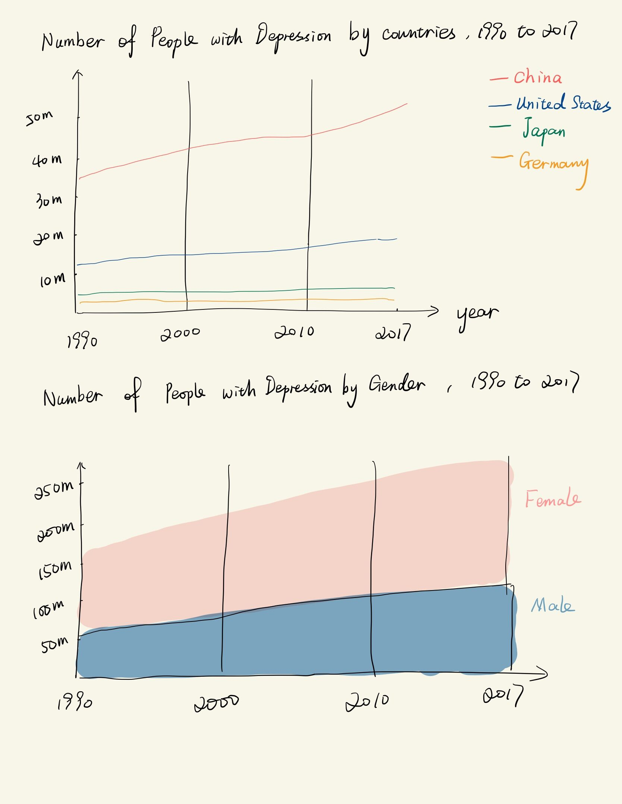

# Final Project

## Outline

* Topic: Life is Better, but People are Unhappier.

* Summary:

Up to 2017, there were around 265 million depression patients in the world, which were 95 million more than that in 1990. 
This project used data visualization to show the prevalence of mental health disorder by age, gender, level of education, and contries from 1990s to 2010s.

* Structure:
  * A short introduction of the mental health disorders.
  * Data visualizations. (Graphs to show the growth trend of prevalence of mental health disorders by age, gender, level of education, and contries from 1990s to 2010s)
  * Tell the story from the data visualization. (Why the number of female patients is more than twice that of male patients; Why young people are more likely to get depression than olds in US, etc.)
  * Call on society to pay more attention to mental health, and help preventing the mental disroders.

## Initial sketches

 
## The data

Data Source: 

Global Burden of Disease Collaborative Network. Global Burden of Disease Study 2017 (GBD 2017) Results. Seattle, United States: Institute for Health Metrics and Evaluation (IHME), 2018. http://ghdx.healthdata.org/gbd-results-tool 

I plan to extract the data that I need from this data source, for example, the mental disorders by countries, age, gender and educational level. 
And I might not analyze all the countries in my story, so I will filter the data with several main countries in the world.
Then I will import this data to Tableau Desktop to do the data visualization. 

## Method and medium

First, I will filter my data in Excel sheet to make sure it has the information that I need for this project. 

Then, I import these data into Tableau Desktop to do the data visualization. I might do some line charts, bar charts, and other charts that are more intuitive and informative.

While doing the data visualization, I will design the legend, axises, title, and any other things that are helpful to these charts.

Next, I will publish these charts to the Tableau Public.

After finishing the data visualization, I will tell the story from the graphs. And I will publish my data story on the Shorthand. For example, I will state the  development of science and technology makes life better, but doesn't make people happier. More and more people suffer from mental disorders like depression and anxiety. 
Especially for young people and females, pressure of life makes them stressful, and busy work occupies most of their time, so that they have less chance to release the pressure.
COVID made situation worse, because the pandemic can impact people's mental health a lot. Many people lost their jobs, and many people lost their families. Students stay at home to take online course everyday. These all impact people's mental health. Thus, the government and society need to pay more attention to mental health, and help people prevent from mental disorders.  

Finally, the project is finished, and I will do the presentation by sharing the story on Shorthand.

